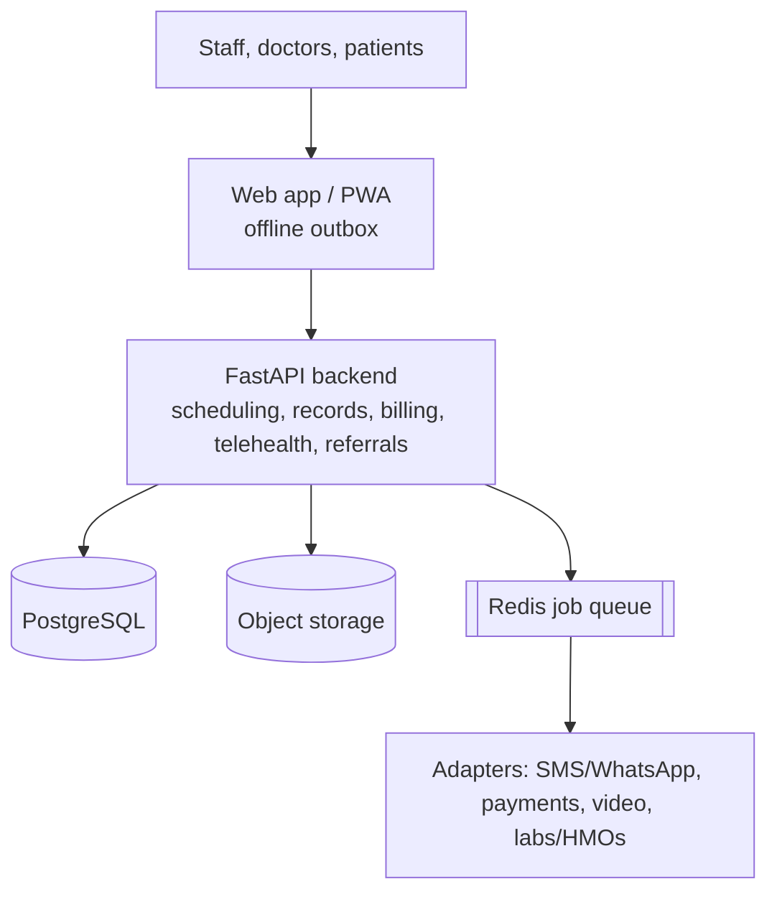
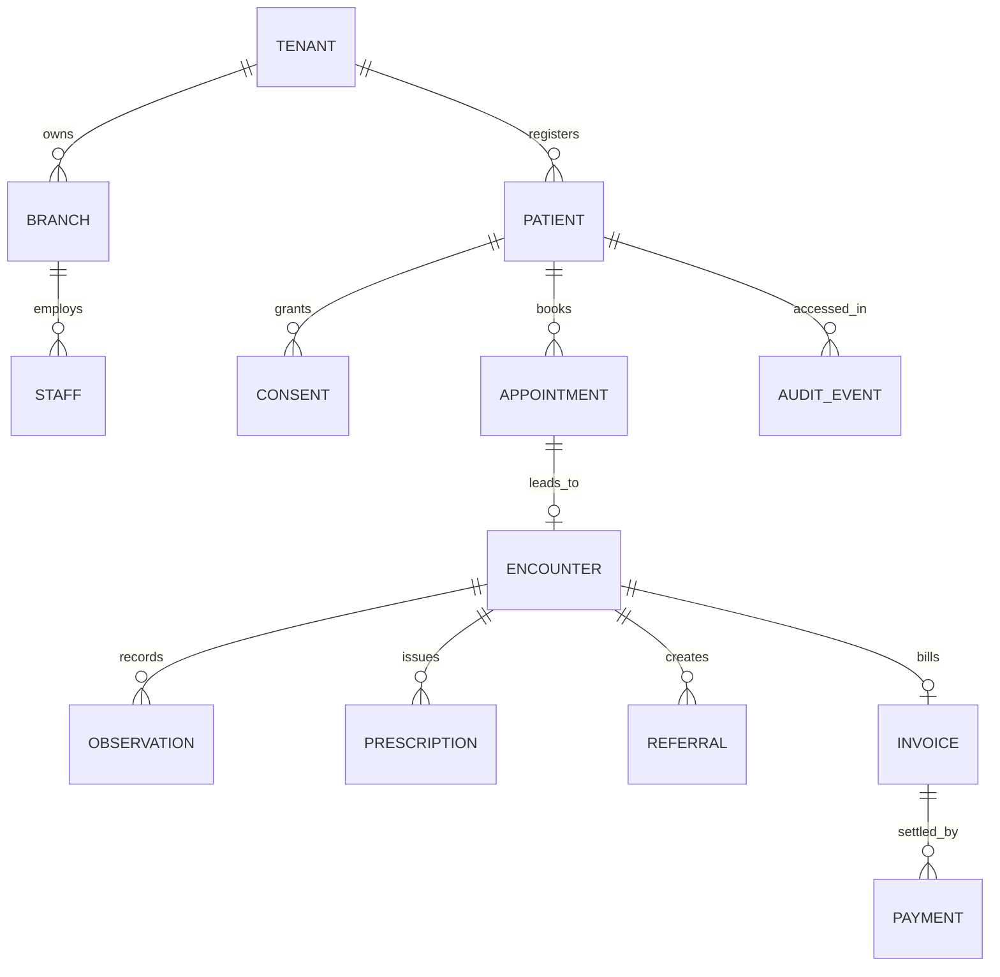

# Africa-first Clinic Platform

> An offline-first clinic management, telemedicine, and patient-record system built for Nigerian clinics, designed to keep working when the internet and power don't.

 

**Live demo:** `[add link]` | **Demo video:** `[add link]` | **Docs:** [PRD](./docs/PRD.md) · [SRS](./docs/SRS.md) · [Decisions](./docs/adr)

> **Important:** this is a portfolio and research project. It has not been through clinical-safety review, a privacy impact assessment, or legal review, and it must not be used with real patient data until those are done.

---

## The problem

Private clinics in Nigeria often run on separate tools for booking, video calls, billing, and patient files. Unreliable internet and power break each of them, records don't follow the patient between clinics, and handling patient data without clear consent is a legal and trust risk.

## The solution

One system that covers the clinic's whole day and keeps working offline:

- **Front desk:** registration with duplicate warnings, appointments, walk-in queue, SMS/WhatsApp reminders, no-show tracking
- **Clinical:** encounters, vitals, allergies, notes, prescriptions, and a clinician-approved patient summary
- **Telemedicine:** pre-consult intake, consent, chat, video with audio/text fallback, follow-up, and referral
- **Money:** invoices, receipts, refunds, daily reconciliation, one payment gateway plus manual cash/transfer
- **Trust:** consent tracking, role-based access, and an append-only audit log of who viewed what
- **Portability:** FHIR-aligned export so records can move between providers

## Key design decisions

| Decision | Why |
|---|---|
| **Offline-first PWA** with an IndexedDB outbox | Clinics lose connectivity; clinical writes must never be silently discarded |
| **Idempotency keys** on every write | A retried sync must never create duplicates |
| **Keep-both conflict rule** | Clinical history is preserved, never overwritten; a clinician resolves clashes |
| **Multi-tenant with row-level isolation** | One clinic can never read another's data |
| **Adapters for SMS, payments, video** | Swap a provider by replacing one adapter, not the system |
| **FHIR-aligned data model** | Open standard for exchanging health data with labs, pharmacies, and insurers |
| **No AI in the MVP** | Get the basics reliable and safe first |

## Architecture



## Data model (core)



## How offline sync works

1. A nurse saves a note with no internet. It is stored on the device and added to the **outbox**.
2. The screen shows **pending**, so nothing is silently lost.
3. When connectivity returns, the outbox sends each write with a **unique ID**.
4. The server ignores duplicates, detects conflicts, and records an audit event.
5. If two edits clash, **both versions are kept** and a clinician picks the correct one.
6. The device receives confirmation and shows **synced**.

## Project structure

A modular monolith organised by feature. See [ADR-0001](./docs/adr/0001-modular-monolith.md).

```
backend/app/core/        config, db, events, shared plumbing
backend/app/modules/     one folder per business area (tenancy, identity, patients, ...)
frontend/src/features/   mirrors the backend modules
docs/                    PRD, SRS, decisions, agent skills
```

## Tech stack

- **Frontend:** Next.js, React, Tailwind CSS, PWA with IndexedDB
- **Backend:** Python, FastAPI, SQLModel, Alembic
- **Data:** PostgreSQL, Redis, S3-compatible object storage
- **Tooling:** Docker / Docker Compose, Git & GitHub, Postman or Bruno for API testing, pytest

## Getting started

```bash
git clone https://github.com/LovethChinenyenwaEU-dev/africa-clinic-platform.git
cd africa-clinic-platform
cp .env.example .env
docker compose up --build
```

- App: http://localhost:3000
- API docs: http://localhost:8000/docs
- Run tests: `docker compose exec api pytest`

## Roadmap (12-week MVP)

- [ ] W1 Foundation: repo, Docker Compose, CI
- [ ] W2 Tenants, branches, staff, roles, auth
- [ ] W3 Patients: registration, duplicate warning, consent
- [ ] W4 Appointments and queue
- [ ] W5 Reminders via job queue and one SMS/WhatsApp adapter
- [ ] W6 Encounters, records, audit log
- [ ] W7 Staff web app screens
- [ ] W8 Offline sync and conflict handling
- [ ] W9 Teleconsult flow
- [ ] W10 Billing and one payment gateway
- [ ] W11 FHIR export, dashboards, security pass
- [ ] W12 Deploy, backup/restore test, demo

Update the checkboxes as you finish each week.

## Security and privacy

- Tenant isolation, least-privilege roles, and short-lived tokens
- Consent and purpose tracking; append-only access logs
- Logs minimise patient data; patient data is never sold
- Designed with the Nigeria Data Protection Act 2023 in mind. This is **not** a compliance certification or legal advice.

## What I learned / hardest problems

- `[Fill in after building: e.g. designing conflict rules that preserve clinical history]`
- `[Fill in: e.g. how I tested tenant isolation]`
- `[Fill in: measured result, e.g. "N of N offline notes synced with zero duplicates"]`

## What's next

Lab-result integration, HMO/insurer APIs, multi-branch groups, and West African adapters (country-specific consent language, payment rails, and telemedicine rules).

## Author

**Loveth Chinenyenwa Edeugwu**: software developer with a background in medical laboratory science (hematology and clinical chemistry).
LinkedIn: [linkedin.com/in/lovethchinenyenwaeu-dev](https://linkedin.com/in/lovethchinenyenwaeu-dev) · GitHub: [LovethChinenyenwaEU-dev](https://github.com/LovethChinenyenwaEU-dev)

## Acknowledgements

Context drawn from WHO workforce estimates, GSMA's Mobile Economy Sub-Saharan Africa 2024, WHO/HL7 interoperability guidance, HL7 FHIR, and the Nigeria Data Protection Commission and MDCN guidance.

## License

`[Choose a license, e.g. MIT, before publishing]`
